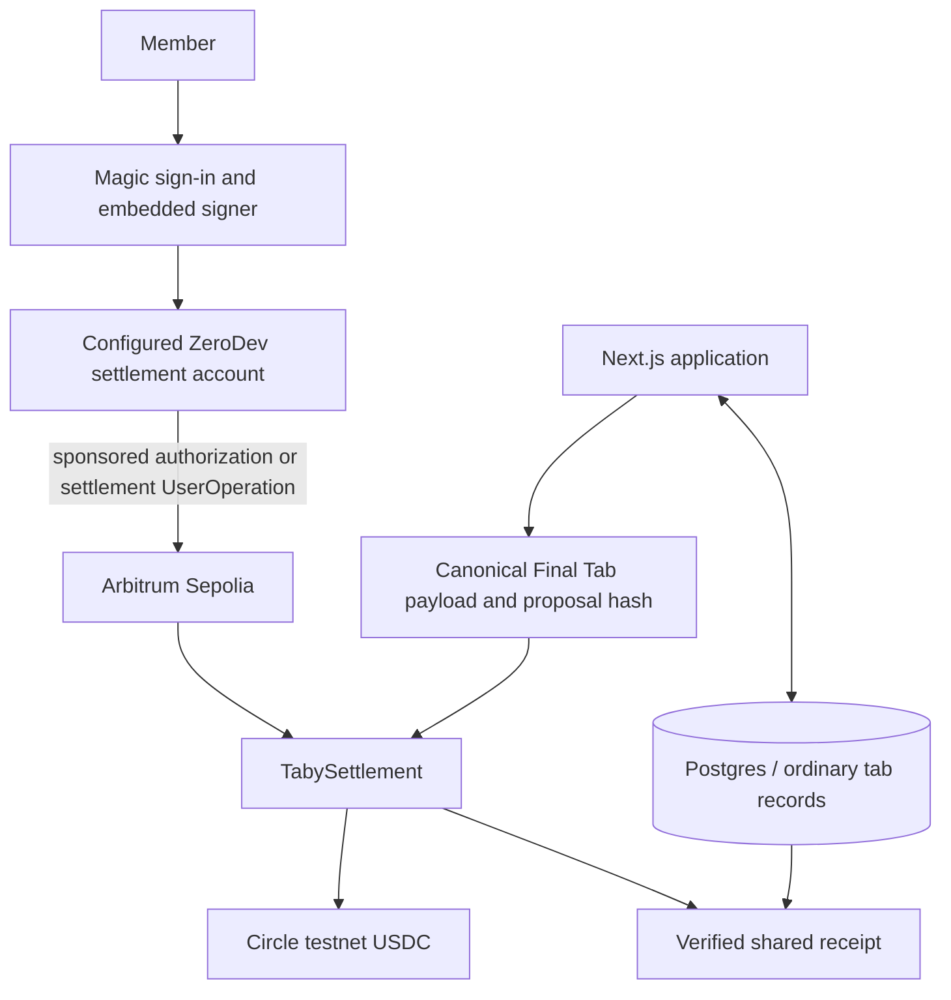

# Architecture

## Roles and boundaries

- Magic handles normal sign-in and supplies the member-controlled signer. There is no wallet-extension or chain-picker requirement in the primary flow.
- ZeroDev provides the configured settlement account path and submits the existing user operations. The active path is either the default `magic_eoa_7702` or the explicitly permitted `zerodev_kernel` fallback; the real settlement address is stored in `user_settlement_accounts`.
- Arbitrum Sepolia is the execution network. `TabySettlement` registers the locked payload, records exact debtor authorization, and settles matching transfers atomically in Circle testnet USDC.
- Supabase/Postgres stores membership, expense confirmation/dispute workflow, Final Tab lifecycle data, durable UserOperation status, settlement attempts, and receipt snapshots.
- The receipt is available only after the persisted proposal and transaction agree with the matching onchain `FinalTabSettled` event.

## Agreement identity

The Final Tab is not a client-side JSON snapshot. [`lib/tabs/finalTab.ts`](../lib/tabs/finalTab.ts) constructs canonical ABI-compatible fields and hashes, while [`TabySettlement.sol`](../contracts/src/TabySettlement.sol) recomputes the payload hash. A cancellation permanently invalidates that proposal hash and requires a new agreement and fresh exact authorizations.

## Explicit non-claims

This architecture does not claim Smart Routing Address, broad chain abstraction, automatic funding, mainnet support, an audit, or trustless validation of real-world expenses.
